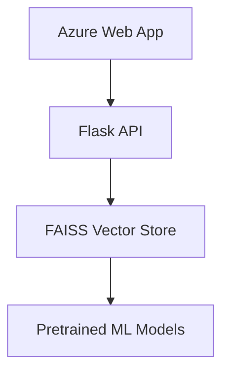

# Papers-Scrap 📚🔍

[](https://www.python.org/downloads/)
[](https://opensource.org/licenses/MIT)
[](https://azure.microsoft.com)

A machine learning-powered academic paper analysis system combining web scraping, NLP techniques, and Azure deployment.

**Live Demo**: [Papers Scrap](https://papers-scrap-fje3hff3g0e3e2c4.eastus-01.azurewebsites.net/)

## Project Overview
Automated tool for analyzing academic publication trends through:
- Web scraping of Google Scholar data
- Multi-model machine learning analysis
- Content-based recommendations
- Trend prediction and clustering

**Key Objectives**:
1. Improve classification & thematic identification of research papers
2. Predict publication trends across 6 academic domains
3. Provide researcher tools for literature discovery

## Features
- **Data Collection**:
  - Automated scraping of paper metadata (title, authors, citations, etc.)
  - 1,200-article dataset across 6 categories (nutrition, biology, finance, etc.)
  
- **Analysis Pipeline**:
  - TF-IDF text vectorization
  - Dimensionality reduction with UMAP
  - Similarity search using FAISS
  
- **ML Capabilities**:
  - Publication trend prediction (Regression)
  - Paper categorization (Classification)
  - Content-based clustering

## Project Structure
```
├── data/               # Collected datasets (CSV format)
├── notebooks/          # Jupyter notebooks for analysis
├── src/
│   ├── scraping/       # Web scraping components
│   └── webapp/         # Azure deployment configuration
```
## Model Performance

### Regression (Trend Prediction)
| Model                | R² Score | RMSE  |
|----------------------|----------|-------|
| Random Forest        | 0.2555   | 6.738 |
| Linear Regression    | 0.2095   | 6.943 |
| Ridge Regression     | 0.2094   | 6.944 |

### Classification (Paper Categorization)
| Model                | Accuracy |
|----------------------|----------|
| Random Forest        | 0.88     |
| CNN (5 epochs)       | 0.88     |
| SVM                  | 0.87     |

### Clustering (Content Grouping)
| Technique            | Rand Score | Mutual Info |
|----------------------|------------|-------------|
| TF-IDF + K-Means     | 0.9046     | 0.9008      |
| SPECTER + UMAP       | 0.7058     | 0.7317      |

## Deployment Architecture


## Key Technologies
- **NLP Processing**: TF-IDF, SPECTER embeddings
- **ML Frameworks**: Scikit-learn, TensorFlow
- **Clustering**: UMAP, FAISS, K-Means
- **Cloud**: Azure Web Apps, Blob Storage
- **Visualization**: Matplotlib, Plotly

## Acknowledgements
- Google Scholar for academic data
- Microsoft Azure for cloud infrastructure
- FAISS development team at Meta Research
